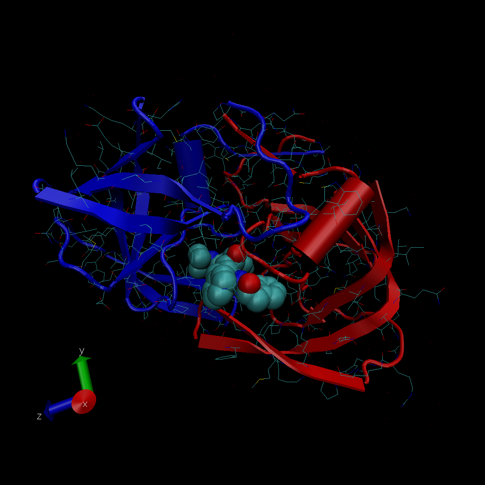
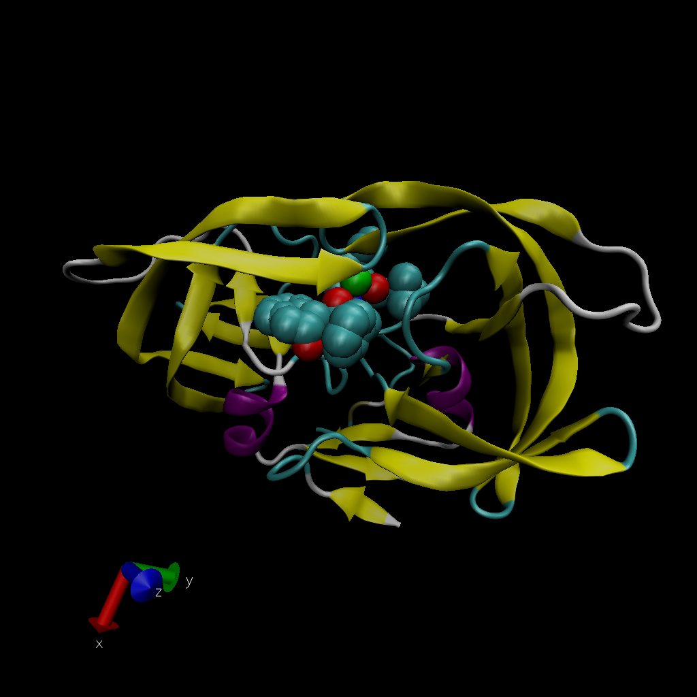
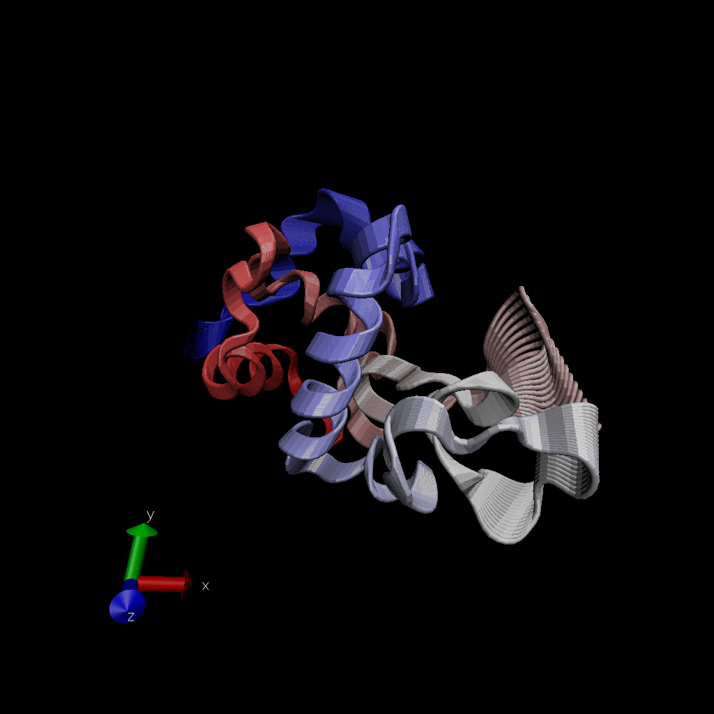
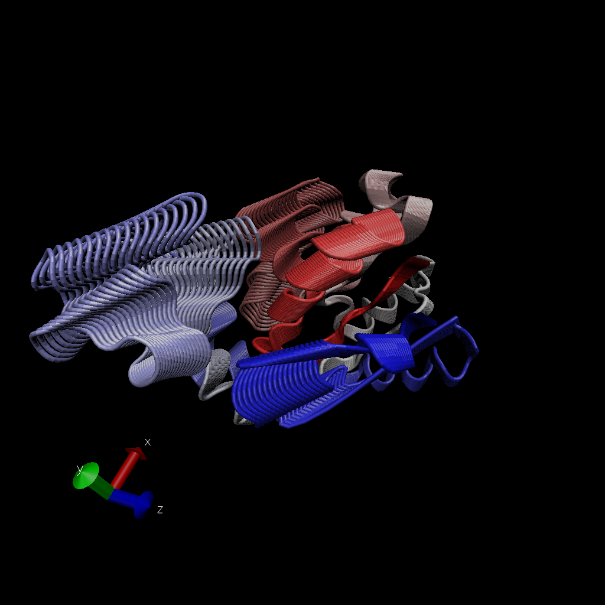

```{r}
db <- read.csv("Data Export Summary.csv", row.names = 1)
head(db)
```

***Q1:***What percentage of structures in the PDB are solved by X-Ray and Electron Microscopy.

```{r}
method.sums <- colSums(db)
round((method.sums/method.sums["Total"]) * 100,2)
```

87.55 percentage of structures in the PDB are solved by X-Ray, and 4.92 percentage of structures in the PDB are solved by Electron Microscopy

***Q2:*** What proportion of structures in the PDB are protein?

```{r}
type.sums <- rowSums(db)
type.sums[1]/method.sums["Total"]
```

```{r}
round(db$Total/method.sums["Total"] * 100, 2)
```

```{r}
proportion_of_protein = 87.36 + 5.14 + 5.31
proportion_of_protein
```

97.81% (0.9781) of structures in the PDB are protein.

***Q3:*** Type HIV in the PDB website search box on the home page and determine how many HIV-1 protease structures are in the current PDB?

There are 1828 HIV-1 protease structures in the current PDB.

## VMD structure visualization image



Just write text but you have some **formatting** options

***Q4:*** Water molecules normally have 3 atoms. Why do we see just one atom per water molecule in this structure?

Water molecules normally have 3 atoms but we do see just one atom (the oxygen atom that is relatively big enough to be seen under the resolution capacity) per water molecule in this structure because the resolution capacity is not high enough to observe the hydrogen atoms that are too small.



***Q5:*** There is a conserved water molecule in the binding site. Can you identify this water molecule? What residue number does this water molecule have (see note below)?

Yes, I can identify this water molecule. That is resid 308 (The residue number this water molecule has is 308).

\#Sequence Viewer Extension [OPTIONAL]

***Q6:*** As you have hopefully observed HIV protease is a homodimer (i.e. it is composed of two identical chains). With the aid of the graphic display and the sequence viewer extension can you identify secondary structure elements that are likely to only form in the dimer rather than the monomer?

Launching the Sequence Viewer click VMD Main window through Extensions and Analysis and Sequence Viewer, I observed different color scales beside the sequence correspond to the B-factor and Secondary structure type. I found that the major ones being Extended (beta) in yellow and Helix in purple (yellow E: extended conformation; purple H: alpha helix). As the major secondary structure elements are extended conformation and alpha helix, I can identify that these elements are likely to only form in the dimer rather than the monomer.

Introduction to Bio3D in R

I need load the library

Reading PDB file data into R

```{r}
library(bio3d)

pdb <- read.pdb("1hsg")
pdb
```

```{r}
aa123( pdbseq(pdb))
```

```{r}
plot.bio3d(pdb$atom$b, sse=pdb)
```

The ATOM records

```{r}
head(pdb$atom)
```

***Q7:*** How many amino acid residues are there in this pdb object?

There are 198 amino acid residues in this pdb object.

***Q8:*** Name one of the two non-protein residues?

One of the two non-protein residues is HOH.

***Q9:*** How many protein chains are in this structure?

2 protein chains are in this structure.

```{r}
attributes(pdb)
```

```{r}
head(pdb$atom)
```

Comparative analysis of protein structures

Setup

```{r}
# Install packages in the R console not your Rmd

#install.packages("bio3d")
#install.packages("ggplot2")
#install.packages("ggrepel")
#install.packages("devtools")
#install.packages("BiocManager")
#BiocManager::install("msa")
#devtools::install_bitbucket("Grantlab/bio3d-view")
```

***Q10.*** Which of the packages above is found only on BioConductor and not CRAN?

msa.

***Q11.*** Which of the above packages is not found on BioConductor or CRAN?

The package bio3d-view is not found on BioConductor or CRAN.

***Q12.*** True or False? Functions from the devtools package can be used to install packages from GitHub and BitBucket?

True.

Using the bio3d package.

```{r}
library(bio3d)
pdb <- read.pdb("1hel")
pdb
```

Let's use NMA to predict the dynamics (flexibility) of this enzyme.

```{r}
modes <- nma(pdb)
plot(modes)
```

Make a "move" of its predicted motion - "trajectory"

```{r}
mktrj(modes, file = "nma.pdb")
```



# Analysis of ADE

```{r}
library(bio3d)
aa<- get.seq("1ake_A")
```

```{r}
b <- blast.pdb(aa)
hits <- plot(b)
hits
```

***Q13.*** How many amino acids are in this sequence, i.e. how long is this sequence?

214 amino acids are in this sequence.

```{r}
# List out some 'top hits'
#head(hits$pdb.id)
```

```{r}
hits <- NULL
hits$pdb.id <- c('1AKE_A','4X8M_A','6S36_A','6RZE_A','4X8H_A','3HPR_A','1E4V_A','5EJE_A','1E4Y_A','3X2S_A','6HAP_A','6HAM_A','4K46_A','4NP6_A','3GMT_A','4PZL_A')
```

```{r}
# Download releated PDB files
files <- get.pdb(hits$pdb.id, path="pdbs", split=TRUE, gzip=TRUE)
```

Align and superpose structures

```{r}
# Align releated PDBs
pdbs <- pdbaln(files, fit = TRUE)#, exefile="msa")
```

```{r}
# Vector containing PDB codes for figure axis
ids <- basename.pdb(pdbs$id)

# Draw schematic alignment
plot(pdbs, labels=ids)
```

Optional: Viewing our superposed structures

```{r}
library(bio3d.view)
library(rgl)

view.pdbs(pdbs)
```

Principal component analysis

```{r}
# Perform PCA
pc.xray <- pca(pdbs)
plot(pc.xray)
```

```{r}
# Calculate RMSD
rd <- rmsd(pdbs)

# Structure-based clustering
hc.rd <- hclust(dist(rd))
grps.rd <- cutree(hc.rd, k=3)

plot(pc.xray, 1:2, col="grey50", bg=grps.rd, pch=21, cex=1)
```

Optional further visualization

```{r}
# Visualize first principal component
pc1 <- mktrj(pc.xray, pc=1, file="pc_1.pdb")
```



```{r}
view.xyz(pc1)
```

```{r}
view.xyz(pc1, col=vec2color( rmsf(pc1) ))
```

plot our main PCA results with ggplot

```{r}
#Plotting results with ggplot2
library(ggplot2)
library(ggrepel)

df <- data.frame(PC1=pc.xray$z[,1], 
                 PC2=pc.xray$z[,2], 
                 col=as.factor(grps.rd),
                 ids=ids)

p <- ggplot(df) + 
  aes(PC1, PC2, col=col, label=ids) +
  geom_point(size=2) +
  geom_text_repel(max.overlaps = 20) +
  theme(legend.position = "none")
p
```


#Normal mode analysis

```{r}
# NMA of all structures
modes <- nma(pdbs)
```

```{r}
plot(modes, pdbs, col=grps.rd)
```

***Q14.*** What do you note about this plot? Are the black and colored lines similar or different? Where do you think they differ most and why?

I note that this plot demonstrates two patterns of fluctuations between colored lines and black lines. Their pattern are different. I think they differ most between about 40 to 60 residues and about 120 to 160 residues, as these differ by a collective low frequency displacement of two nucleotide-binding site regions that display distinct flexibilities upon nucleotide binding (these two sites demonstrate higher fluctuations or flexibilities compared to the reference, which might indicate potential nucleotide-binding site regions that should be further investigated through experiments). These results collectively suggest the existence of two major distinct conformational states for Adk.
